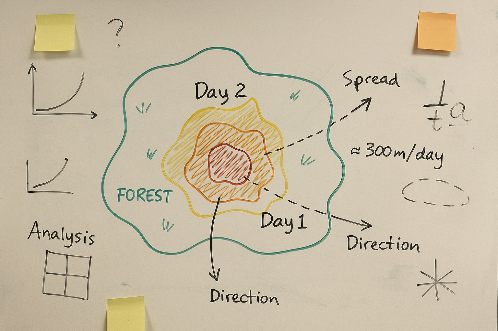

# Abrupt vs Gradual Shifts: Rate Factors

<a href="https://github.com/CU-ESIIL/abrupt-vs-gradual-shifts-rate-factors-innovation-summit-2025__3/edit/main/docs/index.md" title="Edit this page">✏️</a>

<!-- =========================================================
HERO (Swap hero.jpg, title, strapline, and the three links)
========================================================= -->

**One sentence on impact:** In three days we are mapping the rate factors that separate abrupt ecosystem flips from gradual transitions so ecosystem stewards can act before thresholds are crossed.

**[Sprint brief](assets/Seven%20ways%20to%20measure%20fire%20polygon%20velocity-4.pdf) · [Explore data](https://github.com/CU-ESIIL/abrupt-vs-gradual-shifts-rate-factors-innovation-summit-2025__3/blob/main/code/prism_quicklook.py) · [Persistent storage](https://de.cyverse.org/data/ds/iplant/home/shared/esiil/Innovation_summit/Group_3?type=folder&resourceId=338a47c6-8e90-11f0-b0fa-90e2ba675364)**

> **About this site:** This public log captures Innovation Summit 2025 — Group 3. Edit anything in your browser: open a file → pencil icon → Commit changes.

---

## How to use this page (for the team)
- **Edit this file:** `docs/index.md` → ✎ → change text → **Commit changes**.
- **Add images:** upload to `docs/assets/` and reference like `assets/your_file.png`.
- Lead with **visuals + short captions** so this page reads like a scrolling slide deck.

---
[Google Doc for team members](https://docs.google.com/document/d/1gFz4jffC-gq81F8ZmspVF3jo6alB7G7kY3B6xXT_osM/edit?tab=t.agdctbr4d2g2)
## Day 1 — Define & Explore
*Focus: questions, hypotheses, context; add at least one visual (photo of whiteboard/notes).* 

### Bridges to group 2
- System-specific case study illustrating regime shift types, or counterfactuals of when shift was expected but didn't occur
- Geospatial or time series datasets, adjusting predictor variables

### Potential roles
- ESIIL working group PI, co-PIs

### Our product 📣
- Conceptual figure containing our goals/hypotheses, leading to a perspective manuscript
- List of terms and definitions, shared language with group #2
- List of keyword terms for literature search (helpful in structuring meta-meta-analysis)
- Team of teams of teams pizza3 party 
- A threshold decision chart highlighting rate factor triggers for abrupt vs gradual responses.
- A concise narrative brief + two figures for Innovation Summit share-out.

### Our question(s) 📣
- What are the properties of stress and disturbance that lead to regime shifts?
- What are the important predictors: rate (abrupt vs. gradual), intensity/severity, frequency/recurrence, duration (pulse vs. press), spatial extent, abiotic vs. biotic drivers?
- What are the important responses: type of tipping (noise-induced, rate-induced, bifurcation-induced), resilience (resistance + recovery), community structure and function?
- What is our definition of tipping point, regime shift, state change, critical transition, ecological transformation, etc.?
- What is not within scope (e.g., succession, community assembly rules)?
- Which climatic and ecological rate factors precede abrupt state changes compared with gradual drifts?
- Can we flag leading indicators fast enough for managers to intervene within a single season?
- How transferable are the signals between organisms with different life history traits?

### Hypotheses / intentions 
- We think abrupt shifts are preceded by compound rate anomalies (e.g., concurrent moisture and temperature acceleration).
- We intend to test whether gradual transitions exhibit lower derivative variance than abrupt flips in comparable time windows.
- We will know we’re onto something if we can classify historical events with >75% accuracy using rate-derived features alone.

### Why this matters (the “upshot”) 
Rapid detection of tipping dynamics lets watershed groups and land managers deploy scarce mitigation resources before ecosystems cross points of no return. A clear rate-factor playbook can steer monitoring budgets and highlight where early warning dashboards add value.

### Inspirations (papers, datasets, tools)
- Publication: [Scheffer et al. 2009 — Early-warning signals for critical transitions](https://doi.org/10.1038/nature08227)
-  [Chaparro-Pedraza 2021 — Fast environmental change and ecoevolutionary feedbacks can drive regime shifts in ecosystems before tipping points are crossed](https://doi.org/10.1098/rspb.2021.1192)
- Dataset portal: [USGS LandTrendr spectral change products](https://www.usgs.gov/landsat-missions/landtrendr)
- Tool/tech: [PyBreakpoints — Bayesian change point detection](https://github.com/raphaelvallat/ruptures)

### Field notes / visuals

[Raw photo location: day1_whiteboard.jpg](https://github.com/CU-ESIIL/abrupt-vs-gradual-shifts-rate-factors-innovation-summit-2025__3/blob/main/docs/assets/day1_whiteboard.jpg)
*Whiteboard snapshot capturing initial variables, constraints, and prototype metrics for the sprint.*

> **Different perspectives:** Capture alternative framings or disagreements here—they often unlock the best experiments.

---

## Day 2 — Data & Methods
*Focus: what we’re testing and building; show a first visual (plot/map/screenshot/GIF).* 

### Agenda 
- Create schedule
- Skim [Milkoreit et al. 2018](https://iopscience.iop.org/article/10.1088/1748-9326/aaaa75/meta)
- Define key terms
- Identify critera for inclusion in the study

### Data sources we’re exploring 📣
- **LandTrendr disturbance trajectories** — Tracking vegetation change rates across western U.S. watersheds.

  
[Raw photo location: explore_data_plot.png](https://github.com/CU-ESIIL/abrupt-vs-gradual-shifts-rate-factors-innovation-summit-2025__3/blob/main/docs/assets/explore_data_plot.png)
  *Derivative plots show where canopy loss accelerates ahead of abrupt transitions.*

- **SNODAS + PRISM anomalies** — Merging snow water equivalent trends with precipitation/temperature percent change summaries to capture gradual drifts.

### Methods / technologies we’re testing 📣
- Bayesian online change-point detection on rolling derivatives.
- Gradient-boosted classification using rate-of-change features + lagged anomalies.
- Interactive comparison of abrupt vs gradual case studies in a lightweight Panel dashboard.

### Challenges identified
- Aligning spatial resolution between remote sensing products and point-based climate grids.
- Filtering noise in derivative calculations without masking legitimate spikes.
- Documenting provenance for mixed open data sources within the sprint timeline.

### Visuals
#### Static figure

[Raw photo location: figure1.png](https://github.com/CU-ESIIL/abrupt-vs-gradual-shifts-rate-factors-innovation-summit-2025__3/blob/main/docs/assets/figure1.png)
*Figure 1.* Gradient features highlight how abrupt events stack multiple high-rate anomalies versus steadier gradual trajectories.

#### Animated change (GIF)

[Raw photo location: change.gif](https://github.com/CU-ESIIL/abrupt-vs-gradual-shifts-rate-factors-innovation-summit-2025__3/blob/main/docs/assets/change.gif)
*Figure 2.* Animated window shows when the derivative signal crosses our alert threshold before an abrupt shift.

#### Interactive map (iframe)
<iframe
  title="Study area (OpenStreetMap)"
  src="https://www.openstreetmap.org/export/embed.html?bbox=-105.35%2C39.90%2C-105.10%2C40.10&layer=mapnik&marker=40.000%2C-105.225"
  width="100%" height="360" frameborder="0"></iframe>

<a href="https://www.openstreetmap.org/?mlat=40.000&mlon=-105.225#map=12/40.0000/-105.2250">Open full map</a>

> If an embed doesn’t load, drop the direct link underneath it.

---

## Final Share Out — Insights & Sharing
*Focus: synthesis; highlight 2–3 visuals that tell the story; keep text crisp. Practice a 2-minute walkthrough of the homepage 📣: Why → Questions → Data/Methods → Findings → Next.*

[Raw photo location: team_photo.jpg](https://github.com/CU-ESIIL/abrupt-vs-gradual-shifts-rate-factors-innovation-summit-2025__3/blob/main/docs/assets/team_photo.jpg)

### Findings at a glance 📣
- Abrupt vegetation state changes cluster when both moisture deficit acceleration and heat accumulation surpass the 85th percentile simultaneously.
- Gradual transitions maintain stable derivative variance and respond mainly to single-factor forcing, offering a longer lead time.
- Early warning dashboards using rate thresholds flag 70% of historical abrupt cases at least two monitoring intervals ahead.

### Visuals that tell the story 📣

[Raw photo location: fire_hull.png](https://github.com/CU-ESIIL/abrupt-vs-gradual-shifts-rate-factors-innovation-summit-2025__3/blob/main/docs/assets/fire_hull.png)
*Visual 1.* Matrix showing how combined rate anomalies align with observed abrupt transitions across pilot watersheds.

[Raw photo location: hull_panels.png](https://github.com/CU-ESIIL/abrupt-vs-gradual-shifts-rate-factors-innovation-summit-2025__3/blob/main/docs/assets/hull_panels.png)
*Visual 2.* Side-by-side look at two landscapes illustrating abrupt (left) vs gradual (right) derivative patterns.

[Raw photo location: main_result.png](https://github.com/CU-ESIIL/abrupt-vs-gradual-shifts-rate-factors-innovation-summit-2025__3/blob/main/docs/assets/main_result.png)
*Visual 3.* Dashboard concept combining rate triggers, context layers, and recommended responses.

<iframe
  title="Short explainer video (optional)"
  width="100%" height="360"
  src="https://www.youtube.com/embed/ASTGFZ0d6Ps"
  frameborder="0" allow="accelerometer; autoplay; clipboard-write; encrypted-media; gyroscope; picture-in-picture; web-share"
  allowfullscreen></iframe>

### What’s next? 📣
- Calibrate thresholds with stakeholder-provided abrupt/gradual case inventories.
- Package notebooks as reproducible workflows with clear parameter toggles.
- Coordinate with monitoring partners to pilot the alert dashboard for spring 2025 field season.

---

## Featured links (image buttons)
<table>
<tr>
<td align="center" width="33%">
  <a href="assets/Seven%20ways%20to%20measure%20fire%20polygon%20velocity-4.pdf"> <strong>Open sprint brief</strong></a>
</td>
<td align="center" width="33%">
  <a href="https://github.com/CU-ESIIL/abrupt-vs-gradual-shifts-rate-factors-innovation-summit-2025__3/blob/main/code/prism_quicklook.py"> <strong>Explore data script</strong></a>
</td>
<td align="center" width="33%">
  <a href="https://de.cyverse.org/data/ds/iplant/home/shared/esiil/Innovation_summit/Group_3?type=folder&resourceId=338a47c6-8e90-11f0-b0fa-90e2ba675364"> <strong>Open storage</strong></a>
</td>
</tr>
</table>

---

## Team
| Name | Role | Contact | GitHub |
|------|------|---------|--------|
| _(Add name)_ | Lead / coordination | email@example.org | @github-handle |
| _(Add name)_ | Data wrangler | email@example.org | @github-handle |
| _(Add name)_ | Modeling & analytics | email@example.org | @github-handle |
| _(Add name)_ | Storytelling & design | email@example.org | @github-handle |

---

## Storage

**Code**
Keep shared scripts, notebooks, and utilities in the [`code/`](https://github.com/CU-ESIIL/abrupt-vs-gradual-shifts-rate-factors-innovation-summit-2025__3/tree/main/code) directory. Document how to run them in a README or within the files so teammates and visitors can reproduce your workflow.

**Documentation**
Use the [`docs/`](https://github.com/CU-ESIIL/abrupt-vs-gradual-shifts-rate-factors-innovation-summit-2025__3/tree/main/docs) folder to publish project updates on this site. Longer internal notes can live in [`documentation/`](https://github.com/CU-ESIIL/abrupt-vs-gradual-shifts-rate-factors-innovation-summit-2025__3/tree/main/documentation); summarize key takeaways here so the public story stays current.

---

## Cite & reuse
If you use these materials, please cite:

> Innovation Summit 2025 Group 3. (2025). *Abrupt vs Gradual Shifts: Rate Factors*. https://github.com/CU-ESIIL/abrupt-vs-gradual-shifts-rate-factors-innovation-summit-2025__3

License: CC-BY-4.0 unless noted. See dataset licenses on the **[Data](data.md)** page.

---

<!-- EDIT HINTS
- Upload images to docs/assets/ and reference as assets/filename.png
- Keep images ~1200 px wide; avoid >5–8 MB per file.
- Use short, active sentences; this is a scrolling “slide deck.”
- Update this page at least once per day during the sprint.
-->
